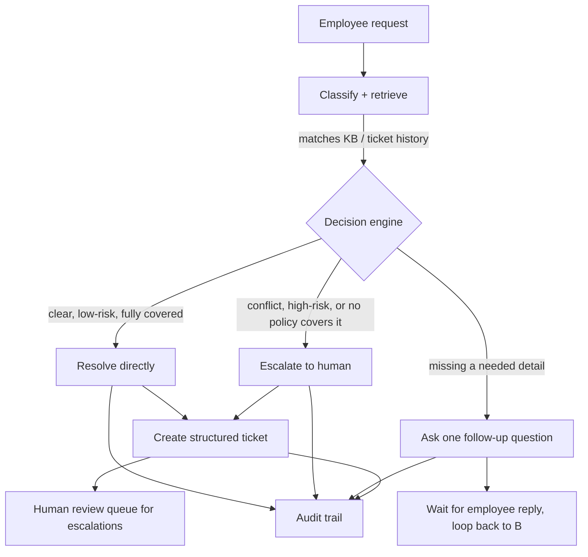
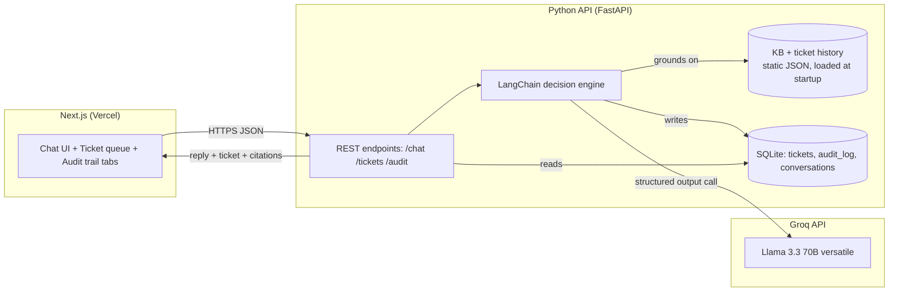

# Assignment 2 — Internal Service Agent (IT Support)
Deliverable pack for Veridian Corp IT Support Agent

---

## 1. Working prototype

Clickable, working prototype (chat + ticket queue + audit trail, grounded in the data pack, no invented policy):

**https://claude.ai/artifact/3j13whmnqXvvYgUACsGEG2**

This is a fully functional single-page agent — try any of the 15 sample requests from the left rail. It calls Claude directly from the browser, creates structured tickets, and logs every decision to an audit trail. Use it to validate the decision logic before or alongside the Next.js/Python build below — they should behave identically, since both are driven by the same rules (Appendix A).

---

## 2. Architecture and process flow

### Process flow



### System architecture (target stack: Next.js + Python + LangChain)



**Why this shape:**
- **No vector database / RAG.** The corpus is 10 KB entries + 1 policy extract + 11 historical tickets — small enough for direct in-context grounding. A retrieval layer would add complexity without adding accuracy here, and it's harder to defend in review than "the full source set is always in context."
- **Structured output, not free text.** The LangChain agent is forced into a fixed schema (`reply`, `action`, `sources`, `ticket`, `escalation_reason`) so every response is a decision the backend can act on (create a ticket, log an entry, route to a human queue), not just conversational text.
- **SQLite, not a hosted DB.** Tickets and the audit log are small, structured, and don't need multi-region availability for a prototype — SQLite keeps the "one-command local run" option genuinely one command.
- **Backend, not frontend, owns the decision engine.** Keeps the Groq API key server-side, keeps the ruleset in one place, and makes the agent testable independent of the UI (mandatory for anyone grading the decision logic directly).
- **Groq, not a hosted-frontier API, powers the production backend.** Groq's LPU inference is fast enough that even a "default" tier structured-output call returns in roughly a second, which matters for a helpdesk chat UX where every turn does a full policy-grounded reasoning pass. Llama 3.3 70B Versatile is used as the default model since it supports both tool calling and structured output in LangChain's Groq integration; swap the `model=` string in `agent.py` to try others (see Prompt 3).
- **Note on the two builds:** the clickable prototype in Section 1 runs inside a Claude.ai artifact and uses Claude via that platform's built-in reasoning capability — that part is fixed by the platform, not swappable. The production build in Section 5 (Next.js + Python + LangChain) is the one that uses Groq end to end, per your request.

---

## 3. Inputs, sources, and assumptions

### Inputs (verbatim from the data pack — see Appendix A for full text)
- 10 knowledge-base policy entries (KB-01 through KB-10)
- 1 policy extract: Asset Management Policy (Finance & Assets, Q2 2026)
- 15 employee requests (REQ-01 through REQ-15), each with an "initial action taken so far"
- 10 historical tickets (TK-1042 through TK-1051), 6 closed (used as precedent), 4 active

### Sources of truth used for every agent decision, in priority order
1. The specific KB entry(ies) matching the request
2. The Asset Management Policy extract, when hardware/refresh-cycle questions are involved
3. Ticket history, used only as precedent when no KB entry directly covers the case (e.g. TK-1050 for the ungrounded admin-access request)
4. Nothing else — the agent is instructed never to state a policy, number, or process step that isn't in one of the above

### Assumptions made explicit (since the data pack is intentionally silent on some things)
- **VPN renewal mechanism (KB-02 gap):** the KB says credentials "must be renewed by the employee" but never says how. The agent is instructed to say this isn't documented and route to IT for manual renewal, rather than inventing a self-service renewal flow.
- **"Verified hardware failure" (KB-03):** the agent does not unilaterally decide a laptop's failure is "verified" — it treats this as a fact for a human to confirm, especially where it collides with the Asset Management Policy's 4-year cycle (REQ-01).
- **Employee identity:** the prototype does not implement real authentication; the person using it is treated as a single generic employee. The production build should sit behind whatever SSO/identity Veridian already uses — this is out of scope for the data pack, so it's assumed rather than built.
- **Escalation destination:** the data pack never specifies a ticketing/ITSM tool IT staff use to pick up escalations. The build assumes a simple internal "human review queue" (a filtered ticket view) rather than integrating with a real system like ServiceNow or Jira, since none is named in the source material.
- **Contractor VPN provisioning (REQ-11):** KB-02 says contractors need manager approval via an access request form; the agent routes to that process rather than granting VPN access itself, since it has no way to verify the form was submitted.

---

## 4. AI tools used, and how

| Tool | Role | How it was used |
|---|---|---|
| **Claude (Sonnet 5, claude.ai)** | Analysis, architecture design, and prototype build | Read and categorized the data pack, identified the deliberate edge cases (policy conflict, security violation, high-risk request with no policy, vague request), designed the architecture, and wrote the working single-page prototype end to end (HTML/CSS/JS + Claude API calls for the reasoning). |
| **Claude via the artifact "sample" capability** | The actual decision engine in the prototype | Every chat turn sends the full KB, ticket history, and decision rules (Appendix A) to Claude, forced into a fixed JSON schema, so the model's output is directly actionable (ticket fields, source citations, escalation flag) rather than free text. |
| **Claude Code (or equivalent coding agent)** | Production build (Next.js + Python + LangChain) | Driven by the prompt pack in Section 5 below — each prompt is self-contained and includes the grounding data and rules, so the coding agent scaffolds the repo, backend, frontend, tests, docs, and GitHub push without needing to invent any policy logic itself. |
| **LangChain (Python) + langchain-groq** | Orchestration framework for the production agent | Wraps a structured-output call (Pydantic schema for the decision output) around `ChatGroq`, and wires it to the KB/ticket-history context and the SQLite persistence layer. No memory or vector-store components are used, per the "why this shape" note in Section 2. |
| **Groq API (Llama 3.3 70B Versatile)** | LLM inference for the production backend | Every `/chat` call sends the grounding data, decision rules, and conversation history to Groq's hosted Llama 3.3 70B Versatile model via LangChain's tool-calling/structured-output support, returning the same `AgentDecision` schema the prototype uses. |

---

## 5. Prompt pack — build the Next.js + Python + LangChain version

**How to use this:** Run these prompts in order through your coding agent (Claude Code, Cursor, etc.), one at a time, checking the output before moving to the next. Each prompt is self-contained. Paste **Appendix A** once at the start of your coding agent session (or keep it in a `CONTEXT.md` file in the repo root and tell the agent to read it before each prompt) so the grounding data and rules are always available and nothing gets invented.

### Prompt 1 — Repo scaffolding

```
Set up a monorepo for an internal IT support agent with this structure:

/web        — Next.js 14 (App Router), TypeScript, Tailwind CSS
/api        — Python FastAPI backend
/api/data   — static JSON files for the knowledge base and ticket history
/docs       — architecture notes and this deliverable pack

Root-level:
- docker-compose.yml that runs /web on port 3000 and /api on port 8000 with one command (`docker compose up`)
- .env.example listing GROQ_API_KEY and any other required variables
- README.md with project overview, one-command local run instructions, and links to /docs
- .gitignore for Node, Python, and env files

Do not add any backend logic yet — this step is scaffolding only. Confirm the folder structure and that `docker compose up` starts both services with placeholder "hello world" responses before moving on.
```

### Prompt 2 — Grounding data and Pydantic schema

```
In /api/data, create:
- kb.json — an array of {id, title, text} objects for KB-01 through KB-10 and ASSET-POLICY, using the exact text from Appendix A of Assignment2_Deliverable_Pack.md. Do not paraphrase or add anything not in the source.
- ticket_seed.json — an array of the 10 historical tickets (TK-1042 through TK-1051) from Appendix A, each with {id, employee, summary, status, closed}.

In /api/app/schemas.py, define Pydantic models for the agent's structured output:
- AgentDecision: reply (str), action (Literal["resolve","ask_followup","escalate"]), sources (list[str]), ticket (TicketDraft | None), escalation_reason (str | None)
- TicketDraft: category (str), summary (str), status (str)
- Ticket: extends TicketDraft with id (str), employee (str), sources (list[str]), request_text (str), created_at (datetime)
- AuditEntry: time (datetime), request (str), action (str), sources (list[str]), ticket_id (str | None), escalation_reason (str | None)

Also create /api/app/rules.py containing a single constant DECISION_RULES holding the exact "DECISION RULES" and "OUTPUT FORMAT" text from Appendix A verbatim, formatted as a Python multi-line string ready to be interpolated into a prompt.
```

### Prompt 3 — LangChain decision engine

```
In /api/app/agent.py, build the decision engine using LangChain with the Groq integration (langchain-groq):

- Load kb.json and ticket_seed.json at module import time.
- Build a system/context string that concatenates: the knowledge base, the ticket history (marking closed vs active), and DECISION_RULES from rules.py — reproduce Appendix A's grounding data exactly, no invented policy text.
- Instantiate `ChatGroq(model="llama-3.3-70b-versatile", temperature=0, api_key=os.environ["GROQ_API_KEY"])` and call `.with_structured_output(AgentDecision)` on it so every call returns a validated AgentDecision object, not free text. Read the model name from an environment variable (GROQ_MODEL, defaulting to "llama-3.3-70b-versatile") so it can be swapped without a code change.
- Set temperature to 0 (or close to it) — this is a compliance/decision task, not a creative one, and low temperature makes the escalate-vs-resolve boundary more consistent across runs.
- Expose a function `run_turn(conversation_history: list[dict], new_message: str) -> AgentDecision` that builds the full message list (context + history + new_message) and returns the parsed decision.
- Only include a non-null `ticket` in the returned decision when action is "resolve" or "escalate", matching the rules.
- Add a small pytest suite in /api/tests/test_agent.py that runs at least these three cases and asserts the expected `action`:
  1. "My laptop won't turn on at all, it's completely dead, had it about 3.5 years now." → expect "escalate" (KB-03 vs Asset Management Policy conflict)
  2. "Can someone give me admin access to the finance reporting server? Need it urgently for month-end." → expect "escalate", and expect "TK-1050" to appear in sources
  3. "hey can you help, its not working" → expect "ask_followup"
Do not hardcode these outcomes — the assertions should test the real agent call.
```

### Prompt 4 — FastAPI backend + persistence

```
In /api/app/main.py, build a FastAPI app with:

- POST /chat — body: {conversation_id: str, message: str}. Loads prior turns for that conversation_id from SQLite, calls agent.run_turn, persists the new user/assistant turns, and if the decision includes a ticket, inserts a new row into the tickets table (auto-generate the next TK-#### id, continuing from TK-1052) and inserts an audit_log row. Returns the AgentDecision plus the created ticket id if any.
- GET /tickets — returns all agent-created tickets (newest first) plus the 10 seeded historical tickets, clearly distinguishing which is which.
- GET /audit — returns the full audit log, newest first.
- GET /health — simple liveness check.

Use SQLAlchemy with SQLite (file-based, /api/data/app.db) for three tables: conversations/messages, tickets, audit_log. Write the schema with a startup migration that creates tables if they don't exist and seeds nothing (seed data stays in the static JSON files, not the DB). Enable CORS for the Next.js dev origin (http://localhost:3000).

Add a pytest for the /chat endpoint covering: a fresh conversation resolves a simple request (e.g. guest Wi-Fi) end-to-end and a ticket row appears in GET /tickets afterward.
```

### Prompt 5 — Next.js frontend

```
Build the /web app to match this UI concept (recreate it cleanly in Next.js + Tailwind, don't just embed an iframe of anything):

- Three-column layout on desktop (collapsing to stacked on mobile): 
  1. Left rail: the 15 sample requests from Appendix A as clickable cards, each showing the employee name and request text; clicking sends it as a chat message.
  2. Center: a chat thread against the backend's /chat endpoint. Each agent reply shows the response text, a badge for the action taken (resolve / ask follow-up / escalate), and small badges for each cited source ID (e.g. KB-03, TK-1050). If a ticket was created, show a compact ticket card inline (ticket id, category, status).
  3. Right panel: two tabs — "Ticket queue" (GET /tickets, newly created tickets first, then the 10 historical ones marked as pre-existing context) and "Audit trail" (GET /audit, newest first, showing timestamp, the request, the action taken, sources cited, and escalation reason if any).
- Visual direction: calm, functional IT-helpdesk aesthetic — warm off-white background, a single deep green or navy accent color, monospace type for ticket IDs and status pills, sans-serif for body text. Avoid generic SaaS-card clichés (no identical rounded cards with soft drop shadows everywhere, no gradient accents, no all-caps section labels). Support light and dark mode via prefers-color-scheme.
- Persist a conversation_id in the browser (crypto.randomUUID(), stored in memory for the session) and send it with every /chat call so multi-turn follow-up questions work.
- Handle loading and error states (backend unreachable, slow response) gracefully — never a blank screen.

Fetch from NEXT_PUBLIC_API_URL (default http://localhost:8000) — do not hardcode the backend URL.
```

### Prompt 6 — End-to-end verification against all 15 requests

```
Run all 15 sample requests from Appendix A through the running app (via the UI or a script hitting /chat directly) and produce /docs/verification.md documenting, for each REQ-01 through REQ-15:
- the action taken (resolve / ask_followup / escalate)
- the sources cited
- whether a ticket was created and its status
- a one-line note on whether this matches the expected handling described in Section 3 of Assignment2_Deliverable_Pack.md (e.g. REQ-01 should escalate on the policy conflict, REQ-10 should escalate and cite TK-1050, REQ-15 should ask a follow-up)

Flag any request where the agent's behavior doesn't match the expected handling, and propose a specific fix to rules.py or agent.py — do not change the underlying KB/ticket data to make a case pass.
```

### Prompt 7 — Documentation and GitHub

```
Finalize /docs and push the repo to GitHub:

1. Update README.md with: project overview, architecture diagram (reuse the mermaid diagrams from Section 2 of Assignment2_Deliverable_Pack.md), one-command run instructions (`docker compose up`), a summary of the decision rules, and a link to /docs/verification.md.
2. Copy Assignment2_Deliverable_Pack.md into /docs if it isn't already there.
3. Initialize git, create a .gitignore that excludes node_modules, __pycache__, .env, and the SQLite file.
4. Create an initial commit with a clear message, then create a new GitHub repository named "veridian-it-support-agent" and push main to it.
5. Confirm the final GitHub URL and paste it back so it can be recorded as the mandatory GitHub link deliverable.

If you don't have GitHub credentials configured, stop and tell me exactly what command to run (e.g. `gh repo create` or the git remote add command) rather than guessing at credentials.
```

---

## Appendix A — Grounding data and decision rules (paste into your coding agent's context)

### Knowledge base
- **KB-01 — Password reset:** Employees can reset their own password via the self-service portal at any time. If locked out after 5 failed attempts, contact IT to unlock the account manually. No approval required.
- **KB-02 — VPN access:** VPN access is granted automatically to all full-time employees. Contractors require manager approval submitted via the access request form. VPN credentials expire every 90 days and must be renewed by the employee.
- **KB-03 — Laptop replacement:** Laptops are eligible for replacement after 3 years of service, or earlier in case of verified hardware failure. Requests must be raised at least 2 weeks in advance of intended replacement.
- **KB-04 — Software installation requests:** Standard software (listed in the approved catalog) can be self-installed. Non-catalog software requires IT Security review, which takes 3–5 business days.
- **KB-05 — Printer troubleshooting:** For printer issues, first check the printer queue and restart the print spooler. If the issue persists after restart, log a ticket with the printer's asset tag.
- **KB-06 — Email mailbox quota:** Default mailbox quota is 25GB. Employees nearing quota should archive old mail. Quota increases beyond 25GB require manager approval and are capped at 50GB.
- **KB-07 — Guest Wi-Fi access:** Guest Wi-Fi credentials are valid for 24 hours and can be generated by any employee from the front-desk kiosk. No IT ticket required.
- **KB-08 — Expense software access:** Access to the expense management tool is granted by Finance, not IT. IT can only assist with login/technical issues once an account already exists.
- **KB-09 — Security incident reporting:** Any suspected phishing email, malware, or unauthorized access attempt must be reported to security@veridian-corp.example immediately and should not be forwarded to other employees.
- **KB-10 — Work-from-home equipment:** Employees working remotely more than 3 days/week are eligible for a one-time home office equipment allowance (chair, monitor). Requires manager sign-off and Finance processing — IT only handles the equipment shipping request once approved.
- **ASSET-POLICY — Asset Management Policy (Finance & Assets, Q2 2026):** All company-issued hardware, including laptops and monitors, follows a standard 4-year refresh cycle from date of issue. Early replacement outside this cycle requires Finance sign-off in addition to IT approval.

### Ticket history (precedent)
TK-1042 R. Verma — VPN credential expired — Resolved [closed]
TK-1043 S. Iyer — Laptop replacement (3.2 yrs old) — Approved, pending fulfillment [active]
TK-1044 A. Khan — Non-catalog software request — Pending Security review [active]
TK-1045 P. Joshi — Mailbox quota increase — Approved at 35GB [closed]
TK-1046 M. Das — Printer paper jam, floor 2 — Resolved [closed]
TK-1047 K. Singh — Home office equipment request — Pending Finance [active]
TK-1048 T. Rao — Phishing email reported — Escalated to Security, under investigation [active]
TK-1049 V. Nambiar — Password reset — Resolved [closed]
TK-1050 J. Fernandes — Admin access request — Rejected, no business justification provided [closed]
TK-1051 L. Menon — Guest Wi-Fi issued — Resolved [closed]

### The 15 sample requests
REQ-01 Aditi Sharma — "My laptop won't turn on at all, it's completely dead, had it about 3.5 years now."
REQ-02 Vikram Chawla — "Can I get Wi-Fi access for a guest visiting our office tomorrow?"
REQ-03 Karan Mehta — "I'm locked out of my account, tried my password 6 times."
REQ-04 Ritu Bhatia — "Need approval to install a data-analysis tool that's not in the software catalog."
REQ-05 Sanjay Oberoi — "My VPN stopped working this morning, says credentials expired."
REQ-06 Meera Iyer — "Printer on the 3rd floor keeps showing 'paper jam' even though there's no jam."
REQ-07 Farhan Ali — "I've started working from home 4 days a week, how do I get a monitor?"
REQ-08 Ananya Reddy — "I think I got a phishing email asking for my login — forwarding it to a few teammates to check."
REQ-09 Rohit Desai — "My mailbox is full and I can't send emails."
REQ-10 Kavya Pillai — "Can someone give me admin access to the finance reporting server? Need it urgently for month-end."
REQ-11 Nikhil Bansal — "New contractor joining my team next week, they'll need VPN access."
REQ-12 Sneha Kulkarni — "I can't log into the expense tool, keeps saying invalid credentials."
REQ-13 Aman Gupta — "Laptop screen is flickering on and off, had it 2 years, might just need a fix not a replacement."
REQ-14 Tanya Chopra — "Requesting approval to install a browser extension for productivity tracking."
REQ-15 Rahul Menon — "hey can you help, its not working"

### Decision rules
1. Ground every claim in a specific source ID. If no source covers the request, say so plainly and escalate rather than guessing.
2. If two sources conflict or overlap ambiguously for this exact case (e.g. a 3-year KB threshold vs a 4-year asset-policy refresh cycle), do NOT silently pick one. Set action "escalate", cite both sources, and explain the conflict in escalation_reason.
3. If missing one concrete fact needed to apply a policy correctly, set action "ask_followup" and ask exactly ONE specific question. Do not create a ticket yet.
4. Treat as high-risk and escalate even if a resolution seems obvious: privileged/admin access requests, financial system access, unusual urgency used to push past normal process, and anything security-incident related. Cite ticket precedent when relevant (e.g. TK-1050 for ungrounded access requests).
5. If the true approval authority is Finance or the employee's manager and IT's role is limited (shipping, technical login help, etc.), say exactly what IT can and cannot do. Do not approve something that is not IT's call.
6. If the employee's own message describes a policy violation already committed (e.g. forwarding a suspected phishing email to teammates instead of security@veridian-corp.example), gently correct the process in the reply in addition to handling the immediate issue.
7. Be consistent with ticket history precedent. Do not resolve a case differently from a closed ticket covering the same situation without justification.
8. If the message is too vague to act on, ask a clarifying question — do not guess what the issue is.
9. Keep the reply concise (1–4 sentences), professional, plain language, IT-helpdesk tone. No markdown.

### Output format (structured decision schema)
```json
{
  "reply": "message shown to the employee",
  "action": "resolve | ask_followup | escalate",
  "sources": ["KB-01", "TK-1050"],
  "ticket": null,
  "escalation_reason": null
}
```
`ticket`, when not null: `{ "category": "...", "summary": "...", "status": "Resolved | Pending IT action | Pending manager approval | Pending Finance | Pending Security review | Escalated - awaiting human review | Awaiting employee response" }`. Only non-null when action is "resolve" or "escalate".