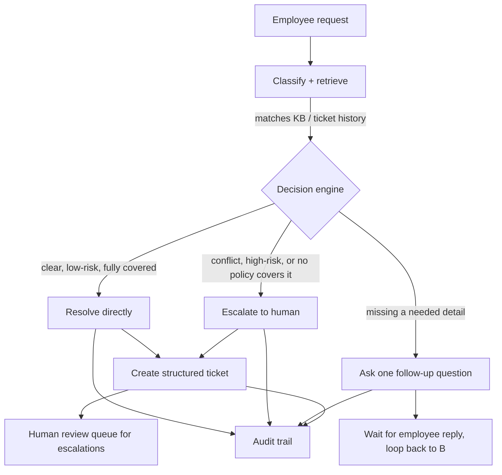
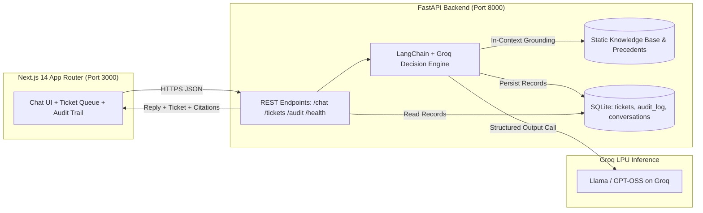

# Veridian Corp — Internal IT Support Agent Monorepo

Deliverable pack and full-stack implementation of the Veridian Corp Internal IT Support Agent — powered by Next.js 14 (App Router), FastAPI, LangChain, SQLite persistence, and Groq LPU inference.

---

## 1. Project Overview & Working Architecture

The system enables automated, policy-grounded IT helpdesk assistance for employees while strictly enforcing company compliance, security incident routing, ticket precedent consistency, and authority boundaries.

### Process Flow



### System Architecture



---

## 2. Monorepo Structure

```
.
├── api/                    # Python FastAPI backend
│   ├── app/
│   │   ├── agent.py        # LangChain decision engine with Groq structured output
│   │   ├── database.py     # SQLite persistence models (conversations, tickets, audit)
│   │   ├── main.py         # FastAPI endpoints (/chat, /tickets, /audit, /health)
│   │   ├── rules.py        # Exact Appendix A Decision Rules verbatim
│   │   └── schemas.py      # Pydantic schemas for AgentDecision, TicketDraft, AuditEntry
│   ├── data/               # Static JSON grounding data & SQLite DB
│   │   ├── kb.json         # 10 KB articles + ASSET-POLICY
│   │   ├── ticket_seed.json# 10 historical precedent tickets (TK-1042..TK-1051)
│   │   ├── sample_requests.json # 15 sample requests (REQ-01..REQ-15)
│   │   └── app.db          # SQLite database file
│   ├── tests/              # Pytest test suite (unit + end-to-end integration)
│   ├── Dockerfile          # Backend container definition
│   └── requirements.txt    # Python dependencies
├── web/                    # Next.js 14 App Router frontend
│   ├── src/
│   │   ├── app/            # App layout, global styles, and 3-column UI page
│   │   ├── components/     # Header, SampleRail, ChatThread, TicketQueue, AuditTrail
│   │   ├── data/           # Sample requests dataset
│   │   └── types/          # TypeScript interfaces
│   ├── Dockerfile          # Multi-stage optimized Node 20 container
│   ├── package.json        # Frontend dependencies (Next.js, React, Tailwind, Lucide)
│   └── tsconfig.json       # TypeScript configuration
├── docs/                   # Documentation & Deliverables
│   ├── architecture.md     # In-depth architectural notes & component specifications
│   ├── decision_rules.md   # Grounding rules, escalation paths, and decision schema
│   ├── deliverables.md     # Deliverables summary
│   └── verification.md     # Verification report across all 15 sample requests
├── docker-compose.yml      # Single-command local orchestration
├── .env.example            # Environment configuration template
├── .gitignore              # Git ignore configuration
└── README.md               # Monorepo documentation
```

---

## 3. Quick Start (One-Command Local Run)

### 1. Configure Environment
Copy the `.env.example` file to `.env`:
```bash
cp .env.example .env
```
Edit `.env` and set your `GROQ_API_KEY`:
```env
GROQ_API_KEY=gsk_your_groq_api_key_here
GROQ_MODEL=openai/gpt-oss-120b
```

### 2. Start Both Services via Docker Compose
```bash
docker compose up --build
```

- **Web Frontend**: [http://localhost:3000](http://localhost:3000)
- **FastAPI Backend**: [http://localhost:8000](http://localhost:8000)
- **Interactive Swagger Docs**: [http://localhost:8000/docs](http://localhost:8000/docs)
- **Health Check**: [http://localhost:8000/health](http://localhost:8000/health)

---

## 4. Summary of Decision Rules

1. **Ground Every Claim**: Every answer must cite specific source IDs (`KB-01`..`KB-10`, `ASSET-POLICY`, `TK-1042`..`TK-1051`). If no source covers the request, escalate rather than guessing.
2. **Handle Conflicts**: If sources conflict (e.g. 3-year `KB-03` vs 4-year `ASSET-POLICY`), escalate and explain the conflict in `escalation_reason`.
3. **Missing Information**: Ask exactly **one** specific follow-up question with action `ask_followup` and a null ticket.
4. **High-Risk & Security Escalation**: Treat admin access, financial server requests, and security incidents (phishing/malware) as high risk. Escalate immediately citing `TK-1050` or `TK-1048`.
5. **Authority Boundaries**: Clearly specify IT's role vs Manager/Finance sign-offs.
6. **Correct Violations**: If an employee commits a policy violation (e.g. forwarding phishing emails to teammates), gently correct the protocol.
7. **Precedent Consistency**: Maintain strict consistency with historical tickets.

---

## 5. Verification & Test Suite

- **15 Sample Requests Benchmark**: Full test report available in [docs/verification.md](file:///d:/Project/AgenticAI/Internal_Service_Agent/docs/verification.md).
- **Automated Pytest Suite**:
  ```bash
  cd api
  pytest -v tests/
  ```

---

## 6. Deliverables & Documentation

| Document | Description |
|----------|-------------|
| [architecture.md](docs/architecture.md) | In-depth architectural notes & component specs |
| [decision_rules.md](docs/decision_rules.md) | Grounding rules, escalation paths, and decision schema |
| [deliverables.md](docs/deliverables.md) | High-level deliverables summary |
| [verification.md](docs/verification.md) | 15-request benchmark compliance report |
