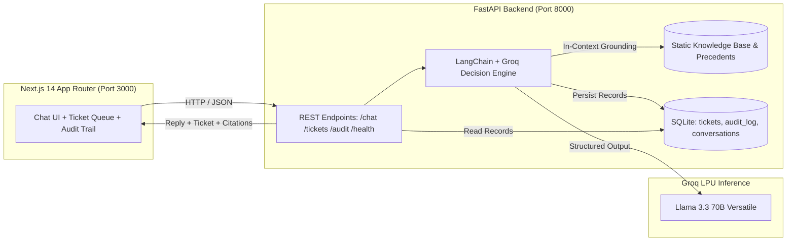

# System Architecture — Internal IT Support Agent

## Overview

The Veridian Corp Internal IT Support Agent is a full-stack, policy-grounded support system designed to assist employees with IT issues, enforce organizational security and asset policies, create structured tickets, and maintain an immutable audit trail.

## Architectural Design Principles

1. **In-Context Grounding (No Vector DB / RAG Overhead):**
   - The knowledge base (10 KB articles + 1 Asset Management Policy + 10 historical tickets) fits entirely within the LLM's context window.
   - Grounding directly in-context eliminates embedding drift, retrieval misses, and unnecessary operational infrastructure.

2. **Strict Structured Output (Zero Unconstrained Free-Text Hallucinations):**
   - The agent output is strictly validated against a Pydantic schema (`AgentDecision`) containing explicit actions (`resolve`, `ask_followup`, `escalate`), citations list, optional structured ticket draft, and escalation reasons.

3. **Deterministic Low-Temperature Inference:**
   - Groq LPU inference with `temperature=0` using `llama-3.3-70b-versatile` ensures compliance boundaries (e.g. policy conflicts or ungrounded privilege escalations) are triggered predictably.

4. **Modular Monorepo Structure:**
   - `/web`: Next.js 14 (App Router, TypeScript, Tailwind CSS).
   - `/api`: Python FastAPI backend with LangChain, Pydantic, and SQLite persistence.
   - `/api/data`: Static JSON data files (`kb.json`, `ticket_seed.json`, `sample_requests.json`).
   - `/docs`: Architecture documentation, decision rules, and verification reports.
